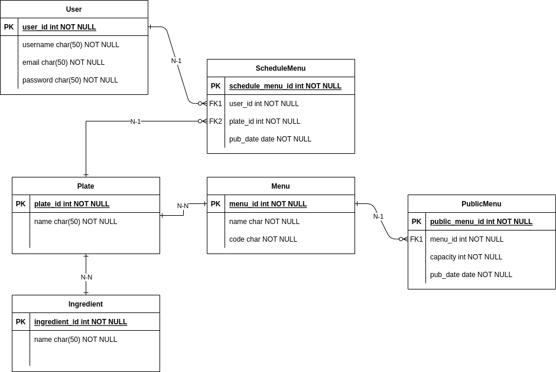

# CapitalizAcme
This project is a simplified DRF Api to handle Coyote's Menu scheduling

*I'm a compromised developer, evangelist of the TDD, but for the sake of simplicity and in honor to the time, im not writing tests, please forgive me*
## RUN IT WITH DOCKER
A `Makefile` is installed to make your life easier while running this project

Run `make help` to find more about the available commands

If you are in a rush, just run:

- `make build` To build the project based on a Dockerfile
- `make up` To run the proyect in a not-detached mode

Then go to `http://0.0.0.0:8000`
## RUN IT WITHOUT DOCKER
First, create virtual enviroment named venv

`capitalizacme$ virtualenv --python=python3 venv`

Then activate the virtual enviroment named venv

`capitalizacme$ source venv/bin/activate`

Install the dependencies

`capitalizacme$ pip install -r requirements.txt`

Run the project

`capitalizacme$ python manage.py runserver`

Then go to `http://127.0.0.1:8000`

## Add Necessary Data
To perform a valid using test, you need to populate the Postgres Database using de `superadmin` user of Python.

For this, please follow this instructions:
- Run `make register`
- Enter a password (*dont forget it!*)
- Go to `/admin`
- Enter this user: `alan`, and the password you added
- Start populating things

You can also populate the database with the following instructions:
- Run `make up` in one terminal
- Open another terminal
- Run `make seed`

### What I need to populate?
#### Ingredients
The main things of any food plate, you can create something like: Chicke, Rice, Potato, Suspiro Limeno, Lemon Pie, etc

#### Plate
Create a Plate of food, that is make of ingredients

#### Menu
Create a Menu composed by N Plates, and give it a name!

#### Public Menu
Publish your menu to the Coyotes, for some specific Date

### How does it works?
A Menu is composed by N Plates, and a Plate is composed by N Ingredients. When an admin decides to make Public a Menu in a certain date, then he/she creates a PublicMenu. Then, when some Coyote needs to schedule one of this public menus, he/she creates a ScheduleMenu, for a certain Plate of a Menu of the available PublicMenus.

When the Coyote needs to change an ingredient of the ScheduledMenu, then he/she needs to specify the new ingredients of the Plate of a certain ScheduledMenu, so if everything is correct, then a new Plate is assigned to the ScheduledMenu, with the new ingredients, and also is flagged as personalized.

Here is a basic ERD, hope it helps!

## Check the Docs
Go to `/api/swagger/schema/` to check the documentation. You can try every endpoint (its OpenAPI), but if you have Postman, use it! Check our `json` documentation in the `doc/` directory.
